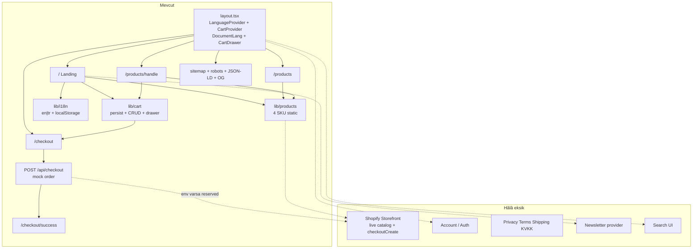

# Vitaself Storefront — Mimari Rapor ve Checklist (Güncel)

> Güncelleme: 2026-07-28  
> Branch: `cursor/urunler-ve-pdp-41a5`  
> Durum: Marketing landing + çok ürünlü katalog + PDP (upsell/cross-sell) + sepet drawer + **mock checkout**. Canlı Shopify / auth / legal hâlâ eksik.

---

## 1. Özet verdict

Satış **iskeleti** hazır: ürün vitrini, PDP, sepet (persist + CRUD), checkout formu ve API (mock), SEO orta maddeleri tamamlandı.

Bloklayıcı kalanlar: **gerçek ödeme (Shopify)**, **hesap/auth**, **legal sayfalar**, **gerçek newsletter**, header’daki **Search/Account** ölü kontroller.

---

## 2. Mevcut route haritası

| Route | Durum | Not |
|---|---|---|
| `/` | Var | 12 section landing + sticky buy |
| `/products` | Var | Koleksiyon hero + grid + trio spotlight |
| `/products/[handle]` | Var | 4 SSG PDP + upsell/cross-sell |
| `/checkout` | Var | Mock ödeme formu (`noindex`) |
| `/checkout/success` | Var | sessionStorage sipariş özeti |
| `POST /api/checkout` | Var | Katalog doğrulamalı mock order |
| `/sitemap.xml` | Var | `app/sitemap.ts` |
| `/robots.txt` | Var | `app/robots.ts` |
| Auth / account / legal / blog | Yok | — |

### PDP handle’ları

- `daily-foundation`
- `sleep-depth`
- `algal-omega`
- `essentials-trio`

---

## 3. Mimari diyagram (güncel)

---

## 4. Sayfa yapıları

### 4.1 Landing `/`

`SiteHeader` → Hero → FeaturedProduct → Benefits → Ingredients → Science → Lifestyle → Comparison → Reviews → Certificates → Doctor → Faq → Newsletter → `SiteFooter` + `StickyBuyBar`  
Featured varyant seçimi `FeaturedVariantProvider` ile sticky bara senkron.

### 4.2 Shop `/products`

ShopHero → ProductGrid (4 ürün) → ShopBundleSpotlight (Essentials Trio)

### 4.3 PDP `/products/[handle]`

Back link → Gallery + Purchase (varyant, miktar, cross-sell checkbox’lar) → UpsellStack (FBT) → RelatedProducts (quick add)  
Post-ATC: CrossSellPrompt modal

### 4.4 Checkout

İletişim + adres + kart/havale → `POST /api/checkout` → success + `clear()`

---

## 5. Tamamlananlar (kanıtlı)

### Katalog & PDP
- [x] `/products` koleksiyon
- [x] 4 ürünlü static katalog (`lib/products.ts`)
- [x] PDP galeri + satın alma
- [x] Upsell: subscribe/save, miktar indirimi UI, stack FBT, kargo eşiği
- [x] Cross-sell: panel checkbox, post-ATC prompt, related quick add

### Sepet (kritik)
- [x] `add` / `remove` / `update` / `clear` / `subtotal` / `count`
- [x] localStorage persist (`vitaself-cart`)
- [x] Cart drawer UI
- [x] Header bag → `openCart`
- [x] Featured / sticky add sonrası drawer açılışı

### Checkout (kritik — mock)
- [x] `/checkout` formu
- [x] `POST /api/checkout` (katalog doğrulama)
- [x] `/checkout/success`
- [x] Shopify env reserved (`.env.example`) — henüz canlı değil

### Orta öncelik
- [x] Dil persist (`vitaself-lang`)
- [x] `html lang` + client title/description sync (`DocumentLang`)
- [x] Open Graph + Twitter + canonical + `metadataBase`
- [x] JSON-LD (Organization, WebSite, Product, Collection)
- [x] `sitemap.xml` + `robots.txt`
- [x] Sticky bar featured seçili varyanta bağlı
- [x] `typescript.ignoreBuildErrors` kaldırıldı

### Navigasyon
- [x] Header Shop → `/products`
- [x] Footer Shop kolon linkleri gerçek PDP’lere
- [x] Hash learn linkleri `/#…`

---

## 6. Kalanlar (önem sırası)

### Kritik
- [ ] **Gerçek Shopify checkout** — `shopifyReady` bloğu boş; siparişler hep `mode: 'mock'`
- [ ] **Canlı katalog / stok** — Storefront API yok; static `products.ts`

### Yüksek
- [ ] Auth / customer account / abonelik yönetimi
- [ ] Header **Account** butonu (ölü) — bağla veya gizle
- [ ] Header **Search** butonu (ölü) — bağla veya gizle
- [ ] Newsletter gerçek submit (şu an local `submitted`)
- [ ] Legal sayfalar: Privacy, Terms, Shipping & returns, Cookie / KVKK
- [ ] Footer legal linkleri hâlâ `#top`

### Orta
- [ ] Locale URL stratejisi (`/tr`, `/en`) — SSR metadata hâlâ EN ağırlıklı
- [ ] Ingredients “panel indir” / Science “white paper” gerçek asset
- [ ] Certificates / batch COA linkleri
- [ ] Learn/Company footer stub’ları (Careers, Press, Contact…)
- [ ] PDP miktar indirimi sepete yansımıyor (yalnızca UI fiyatı)
- [ ] Cart/cross-sell modal focus trap
- [ ] Checkout’un sitemap’te olup `noindex` olması (temizle)

### Düşük
- [ ] ESLint config + çalışan `pnpm lint`
- [ ] Unit / e2e testler (cart persist, checkout, lang toggle)
- [ ] FAQ `aria-controls` / panel id
- [ ] Doctor `figcaption` yapısal düzeltme
- [ ] `images.unoptimized` kaldırma
- [ ] Kullanılmayan `Button` UI bileşeni

---

## 7. Checklist → durum matrisi

| Madde | İlk rapor | Şimdi |
|---|---|---|
| Tek landing `/` | Var | Var |
| Ürün listesi / PDP | Yok | **Var (4 SKU)** |
| Cart UI | Yok | **Var (drawer)** |
| Cart persist + CRUD | Yok | **Var** |
| Checkout | Yok | **Mock var** |
| Shopify canlı | Yok | Yok (placeholder) |
| Upsell / cross-sell | Yok | **Var** |
| i18n EN/TR dictionary | Var | Var + **persist + html lang** |
| Locale URL | Yok | Yok |
| OG / JSON-LD / sitemap / robots | Yok | **Var** |
| `ignoreBuildErrors` | Açık | **Kapalı** |
| Sticky varyant sync | Hep subscription | **Featured ile sync** |
| Auth / account | Yok | Yok |
| Newsletter gerçek | Yok | Yok |
| Legal sayfalar | Yok | Yok |
| Search / Account | Ölü | Ölü |
| Testler / ESLint | Yok | Yok |

---

## 8. Veri / state katmanı (güncel)

| Katman | Durum |
|---|---|
| Ürün | Static 4 SKU, Shopify-shaped tipler |
| Sepet | Context + localStorage + drawer |
| i18n | Context + localStorage; URL locale yok |
| Sipariş | Mock API → sessionStorage last order |
| Auth | Yok |
| CMS | Yok |
| Ödeme | Mock card / transfer; gerçek gateway yok |

---

## 9. Önerilen sonraki 5 öncelik

1. **Shopify Storefront** — canlı ürün + `checkoutCreate` / hosted checkout (mock’u kapat)
2. **Legal sayfalar** + footer legal linklerini bağla
3. **Search / Account** — gizle veya gerçek arama + Customer Account
4. **Newsletter** — Klaviyo / Resend + double opt-in
5. **ESLint + smoke testler** — cart persist, checkout happy path, lang toggle

---

## 10. Hızlı dosya referansı

| Alan | Dosyalar |
|---|---|
| Katalog | `lib/products.ts` |
| Sepet | `lib/cart.tsx`, `components/cart/cart-drawer.tsx` |
| Checkout | `app/checkout/*`, `app/api/checkout/route.ts`, `lib/orders.ts` |
| PDP | `components/pdp/*` |
| Shop | `components/shop/*` |
| i18n | `lib/i18n.tsx`, `components/document-lang.tsx` |
| SEO | `lib/site.ts`, `app/sitemap.ts`, `app/robots.ts`, `components/seo/json-ld.tsx` |
| Featured sync | `lib/featured-variant.tsx` |

---

## 11. Sonuç

**Bitti:** vitrin, PDP, upsell/cross-sell, sepet, mock checkout, orta SEO/i18n.  
**Kaldı (yüksek+):** canlı Shopify ödemesi, auth, legal, newsletter, Search/Account.  
**Kaldı (orta/düşük):** locale URL, içerik asset’leri, a11y, test/lint, image optimization.
