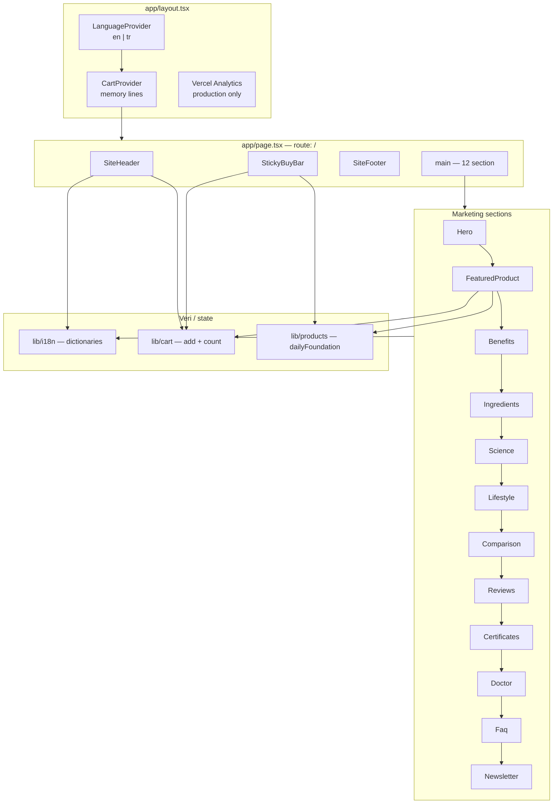
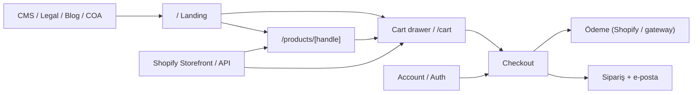
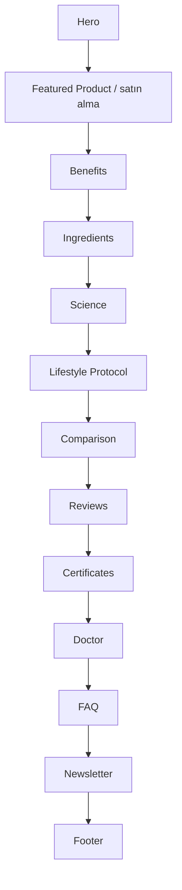

# Vitaself Storefront — Mimari Rapor, Plan ve Checklist

> Tarih: 2026-07-28  
> Repo: `vitaself-store` (Next.js 16 + React 19 + Tailwind 4)  
> Durum: Tek sayfalık D2C marketing landing + ince sepet/i18n soyutlaması. Gerçek e-ticaret katmanı henüz yok.

---

## 1. Özet

Proje şu an **Shopify’a bağlanmaya hazır şekilli** (Shopify-shaped) ürün ve sepet tipleriyle yazılmış bir **bilingual (EN/TR) landing storefront**. Tek route (`/`) üzerinde 12 marketing section + header/footer/sticky buy bar çalışıyor. Checkout, ürün detay sayfası (PDP), API, auth, ödeme ve kalıcı sepet yok.

---

## 2. Teknoloji yığını

| Katman | Seçim |
|---|---|
| Framework | Next.js 16 (App Router) |
| UI | React 19, client components ağırlıklı |
| Stil | Tailwind CSS 4, shadcn (base-nova), CSS variables |
| Animasyon | `motion` (Framer Motion) |
| İkon | lucide-react |
| i18n | Client Context (`lib/i18n.tsx`) — `en` / `tr` |
| Sepet | Client Context (`lib/cart.tsx`) — memory-only |
| Ürün | Static (`lib/products.ts`) — Shopify GID shape |
| Analytics | `@vercel/analytics` (yalnızca production) |
| Font | Geist Sans / Geist Mono / Instrument Serif |

---

## 3. Klasör yapısı

```
/
├── app/
│   ├── globals.css          # Tema tokenleri, tipografi yardımcıları
│   ├── layout.tsx           # Root layout, providers, metadata
│   └── page.tsx             # Tek sayfa: HomePage section composition
├── components/
│   ├── reveal.tsx           # Reveal / Section / Eyebrow yardımcıları
│   ├── site-header.tsx      # Announce bar + nav + lang + cart badge
│   ├── site-footer.tsx      # Footer kolonları + legal
│   ├── sticky-buy-bar.tsx   # Scroll sonrası sticky CTA
│   ├── sections/            # 12 landing section
│   └── ui/button.tsx        # shadcn Button (şu an kullanılmıyor)
├── lib/
│   ├── cart.tsx             # CartProvider + useCart
│   ├── i18n.tsx             # LanguageProvider + EN/TR dictionary
│   ├── products.ts          # dailyFoundation ürün modeli
│   └── utils.ts             # cn()
└── public/images/           # Hero, packshot, lab, lifestyle görselleri
```

**Not:** `app/api/**`, ek route’lar (`/products`, `/cart`, `/checkout`), test klasörü ve locale-based routing yok.

---

## 4. Mevcut mimari diyagramı



### Hedef (eksik) e-ticaret katmanı



---

## 5. Sayfa yapısı (HomePage)

`SiteHeader` ve `StickyBuyBar` page shell’inde; içerik `main` içinde sırayla:

| # | Bileşen | Anchor / id | Amaç | Etkileşim |
|---|---|---|---|---|
| — | `SiteHeader` | fixed | Announce, logo, hash nav, EN/TR, Search/User/Cart | Mobile drawer var; Search/User/Cart **ölü** |
| 1 | `Hero` | `#top` | Marka vaadi, 2 CTA, ürün görseli | CTA → `#product`, `#ingredients` |
| 2 | `FeaturedProduct` | `#product` | Ana satın alma, abonelik/tek sefer | Varyant seç + `cart.add` |
| 3 | `Benefits` | `#about` | 4 değer önerisi | Statik |
| 4 | `Ingredients` | `#ingredients` | 6 içerik + makro görsel | CTA “panel indir” → `#product` (dosya yok) |
| 5 | `Science` | `#science` | Lab görseli + 4 istatistik | CTA “white paper” → `#certificates` (PDF yok) |
| 6 | `Lifestyle` | — | 3 adımlı kullanım protokolü | Statik |
| 7 | `Comparison` | — | Vitaself vs tipik multi tablosu | Statik |
| 8 | `Reviews` | `#reviews` | Skor + 3 testimonial | Hardcoded |
| 9 | `Certificates` | `#certificates` | 6 sertifika badge | Link/doküman yok |
| 10 | `Doctor` | — | Klinik endorsement | Statik |
| 11 | `Faq` | — | Accordion SSS | Client accordion |
| 12 | `Newsletter` | — | E-posta capture | **Fake submit** |
| — | `SiteFooter` | `#site-footer` | Shop/Learn/Company + legal | Tüm linkler `#top` |
| — | `StickyBuyBar` | — | Scroll > ~1600px sticky CTA | Her zaman subscription variant ekler |

### Section akış diyagramı



---

## 6. Component tree

```
RootLayout
├── LanguageProvider
│   └── CartProvider
│       └── HomePage
│           ├── SiteHeader
│           ├── main
│           │   ├── Hero
│           │   ├── FeaturedProduct  → useCart, dailyFoundation
│           │   ├── Benefits
│           │   ├── Ingredients
│           │   ├── Science
│           │   ├── Lifestyle
│           │   ├── Comparison
│           │   ├── Reviews
│           │   ├── Certificates
│           │   ├── Doctor
│           │   ├── Faq
│           │   └── Newsletter
│           ├── SiteFooter
│           └── StickyBuyBar         → useCart, variants[0]
└── Analytics (production)

Helpers: Reveal, Section, Eyebrow
UI kit: Button (tanımlı, section’larda kullanılmıyor)
```

---

## 7. Veri ve state katmanı

### 7.1 Ürün (`lib/products.ts`)

- Shopify-shaped tipler: `Money`, `ProductVariant`, `Product`
- Tek ürün: **Daily Foundation** (`handle: daily-foundation`)
- Varyantlar:
  - Subscription: `$54` / `₺1490` (compareAt: `$68` / `₺1860`)
  - One-time: `$68` / `₺1860`
- Yardımcı: `perDayPrice()`
- `getProduct(handle)` henüz yok — yorumda ileride Storefront API ile değiştirileceği belirtilmiş

### 7.2 Sepet (`lib/cart.tsx`)

| Özellik | Durum |
|---|---|
| `add(variantId, qty?)` | Var |
| `lines`, `count` | Var |
| remove / update / clear | Yok |
| Toplam fiyat | Yok |
| localStorage / cookie | Yok (refresh = boş) |
| Cart UI (drawer/page) | Yok |
| Checkout | Yok |

### 7.3 i18n (`lib/i18n.tsx`)

| Özellik | Durum |
|---|---|
| Diller | `en`, `tr` (dictionary tam) |
| `price()` | USD / TRY formatı |
| Default | `en` |
| Persistence | Yok |
| URL locale (`/tr`, `/en`) | Yok |
| `html lang` | Layout’ta sabit `"en"` |
| Metadata | Her zaman İngilizce |

Dictionary bölümleri: `announce`, `nav`, `hero`, `featured`, `benefits`, `ingredients`, `science`, `lifestyle`, `comparison`, `reviews`, `certificates`, `doctor`, `faq`, `newsletter`, `footer`.

---

## 8. Routing haritası

| Route | Durum |
|---|---|
| `/` | Mevcut — tek landing |
| `/products/[handle]` | Yok |
| `/cart` | Yok |
| `/checkout` | Yok |
| `/account`, auth | Yok |
| `/api/*` | Yok |
| Legal sayfalar | Yok (footer `#top`) |
| Blog / Journal | Yok (footer’da vaat var) |
| `sitemap.xml` / `robots.txt` | Yok |
| Locale routes | Yok |

Hash navigasyon (sayfa içi): `#top`, `#product`, `#science`, `#ingredients`, `#reviews`, `#about`, `#certificates`, `#site-footer`.

---

## 9. Eksikler — önem sırası

### Kritik

1. Checkout / ödeme akışı yok — sepete ekleme satışa dönüşmüyor
2. Cart UI yok — bag ikonu ölü; satırlar görülemiyor/düzenlenemiyor
3. Backend / Shopify Storefront / API yok
4. Sepet kalıcılığı yok

### Yüksek

5. PDP / ürün listesi yok — footer’daki Sleep, Omega-3, Bundles sahte
6. Auth / hesap yok — FAQ aboneliği hesaptan yönetmeyi anlatıyor
7. Newsletter formu stub — başarı mesajı, gönderim yok
8. Footer + legal + Search/Account dead link’ler
9. Kargo / vergi / KVKK / iade akışları yok

### Orta

10. i18n: `html lang`, URL locale, lang persist, TR metadata eksik
11. SEO: OG/Twitter, JSON-LD Product, canonical, sitemap yok; çoğu section client
12. CTA uyumsuzlukları (panel indir, white paper)
13. Tek ürün katalog — multi-SKU storefront değil
14. `typescript.ignoreBuildErrors: true`
15. Sticky bar her zaman subscription ekler
16. Cart API eksik (remove/update/clear/totals)

### Düşük

17. Test yok (unit/e2e); ESLint config görünmüyor
18. `Button` kullanılmıyor; `hooks/` boş
19. A11y: FAQ `aria-controls`, doctor figcaption, ölü butonlar
20. `images.unoptimized: true`
21. Metadata `generator: v0.app`

---

## 10. Uygulama planı

Önerilen sıra: önce satışa engel olan kritikler, sonra içerik/SEO, sonra kalite.

### Faz 0 — Temel sağlamlaştırma

- TypeScript `ignoreBuildErrors` kapat; build hatalarını düzelt
- ESLint config ekle; `pnpm lint` yeşil olsun
- Cart/lang için minimal persistence (localStorage)
- Ölü header kontrollerini bağla veya gizle
- Footer linklerini gerçek route’lara veya “yakında” durumuna ayır

### Faz 1 — Ticaret çekirdeği

1. Shopify Storefront (veya benzeri) bağlantısı: `getProduct`, cart mutations
2. Cart drawer + `/cart` sayfası (lines, qty, remove, subtotal)
3. Checkout redirect / hosted checkout
4. Sticky bar’ı seçili varyanta bağla
5. Featured gallery etkileşimi (thumb → main image)

### Faz 2 — Sayfa ve içerik genişletme

1. `/products/[handle]` PDP
2. Katalog / shop listing (footer ürünleri için)
3. Legal sayfalar: Privacy, Terms, Shipping & returns, Cookie
4. Newsletter → gerçek e-posta servisi (Resend / Klaviyo / Mailchimp)
5. COA / batch results arama veya PDF linkleri
6. White paper / ingredient panel indirme varlıkları

### Faz 3 — Hesap ve abonelik

1. Customer account (Shopify Customer Account API veya auth)
2. Abonelik yönetimi (pause / skip / cancel)
3. Sipariş geçmişi

### Faz 4 — i18n ve SEO

1. `html lang` + metadata diline göre güncelle
2. Locale URL stratejisi (`/tr`, `/en` veya subdomain)
3. Open Graph, Twitter cards, Product JSON-LD
4. `sitemap.xml`, `robots.txt`, canonical
5. Kritik section’ları SSR/RSC’ye taşımayı değerlendir

### Faz 5 — Kalite

1. A11y geçişi (FAQ, form labels, focus traps, dead controls)
2. Görsel optimizasyonu (`images.unoptimized` kaldırma)
3. Unit + e2e (cart, i18n toggle, checkout happy path)
4. Performance (LCP hero image, font subset)

---

## 11. Checklist

### 11.1 Mimari doğrulama (mevcut)

- [x] Tek route `/` landing mevcut
- [x] 12 marketing section composition `app/page.tsx` içinde
- [x] EN/TR dictionary tamamlanmış
- [x] Shopify-shaped `Product` / `ProductVariant` tipleri
- [x] İnce `CartProvider` (`add` + `count`)
- [x] Mobile nav drawer
- [x] Sticky buy bar
- [x] Reveal / motion animasyonları
- [ ] Gerçek checkout
- [ ] Gerçek cart UI
- [ ] API / Shopify bağlantısı
- [ ] Çok sayfalı routing

### 11.2 Kritik — ticaret

- [ ] Shopify (veya alternatif) Storefront API entegrasyonu
- [ ] `getProduct(handle)` ile static `dailyFoundation` yerine canlı veri
- [ ] Cart: remove, update quantity, clear
- [ ] Cart: subtotal / currency
- [ ] Cart persistence (cookie veya localStorage + sync)
- [ ] Cart drawer veya `/cart` sayfası
- [ ] Header bag ikonunu cart UI’ya bağla
- [ ] Checkout (hosted Shopify Checkout veya özel)
- [ ] Ödeme sonrası başarı / hata sayfaları
- [ ] Sticky bar seçili varyantı kullansın

### 11.3 Yüksek — ürün ve içerik

- [ ] `/products/[handle]` PDP
- [ ] Shop listing / koleksiyon sayfası
- [ ] Footer ürün linklerini gerçek sayfalara bağla veya kaldır
- [ ] Legal sayfalar (Privacy, Terms, Shipping, Cookies)
- [ ] Newsletter gerçek submit + double opt-in
- [ ] Search kontrolü: bağla veya gizle
- [ ] Account kontrolü: bağla veya gizle
- [ ] Ingredients “panel indir” → gerçek PDF/asset
- [ ] Science “white paper” → gerçek doküman
- [ ] Certificates → indirme / doğrulama linkleri

### 11.4 Orta — i18n / SEO / DX

- [ ] Dil değişince `document.documentElement.lang` güncelle
- [ ] Dil tercihini sakla
- [ ] Metadata’yı dile göre üret
- [ ] Locale URL stratejisi kararlaştır ve uygula
- [ ] Open Graph + Twitter meta
- [ ] Product JSON-LD
- [ ] `sitemap.xml` + `robots.txt`
- [ ] Canonical URL
- [ ] `typescript.ignoreBuildErrors` kaldır
- [ ] ESLint yapılandırması ekle

### 11.5 Düşük — kalite ve a11y

- [ ] FAQ accordion `aria-controls` / panel id
- [ ] Doctor `figcaption` yapısal düzeltme
- [ ] Focusable ölü butonları düzelt
- [ ] `Button` UI bileşenini CTA’larda kullan veya kaldır
- [ ] Next Image optimization aç
- [ ] Unit testler (cart, price, i18n)
- [ ] E2E smoke (landing, add to cart, lang toggle)
- [ ] Lighthouse / Core Web Vitals hedefi

### 11.6 Ürün yol haritası (opsiyonel)

- [ ] Sleep ürünü
- [ ] Omega-3 ürünü
- [ ] Bundles
- [ ] Gift card
- [ ] Journal / blog
- [ ] Batch results arama
- [ ] Scientific board sayfası
- [ ] Careers / Press / Contact

---

## 12. Hızlı referans — dosya ↔ sorumluluk

| Dosya | Sorumluluk |
|---|---|
| `app/layout.tsx` | Fontlar, metadata, providers |
| `app/page.tsx` | Section composition |
| `app/globals.css` | Design tokens |
| `lib/products.ts` | Ürün modeli (Shopify shape) |
| `lib/cart.tsx` | Sepet state |
| `lib/i18n.tsx` | EN/TR metin + fiyat |
| `components/site-header.tsx` | Navigasyon kabuğu |
| `components/site-footer.tsx` | Footer + legal stub |
| `components/sticky-buy-bar.tsx` | Sticky satın alma |
| `components/sections/*` | Landing içerik blokları |

---

## 13. Sonuç

Mevcut kod **pazarlama landing + ticari soyutlama iskeleti**. EN/TR içerik, ürün varyant modeli ve sepete ekleme hazır; satış için checkout, cart UI, backend ve yasal sayfalar zorunlu sonraki adımlar. Yukarıdaki checklist Faz 0 → Faz 1 ile başlanarak önceliklendirilmeli.
